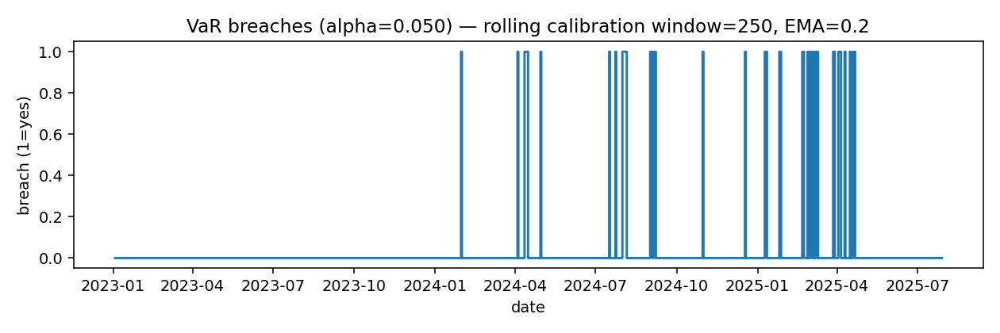

# Intraday Volatility: VaR/ES Decision Memo

**Date:** 2025-08-10  
**Commit:** 57f2cfb  
**Asset:** SPY (2015–2025 holdout from 2023-01-02)

## 1. Executive Summary
- PatchTST (calibrated) coverage **5.08%** at VaR95 (**Kupiec p = 0.945**, **Christoffersen p = 0.714**), status **within** the **6–20** acceptance band; last-window breaches = **14**.
- Calibration: Rolling 250-day intercept calibration on residuals (quantile p=0.035, EMA=0.20); effective N = 394.
- Variance: **HAR** has best **QLIKE** (**-8.960**); PatchTST variance head is competitive.

## 2. Methods
Daily realized-variance target from OHLC (Garman–Klass). Baselines: HAR-RV and GARCH(1,1)-t (map σ̂→VaR with Normal). Deep model: PatchTST with two heads, τ=0.05 return quantile (direct VaR) and log-variance. Calibration uses a rolling intercept shift fit on trailing 250 days. Evaluation uses RMSE/QLIKE for σ² and Kupiec/Christoffersen for VaR; rolling back-tests reported.

## 3. Results
### 3.1 Variance forecast error (holdout)
| model        |     RMSE |   QLIKE |
|:-------------|---------:|--------:|
| HAR          | 0.000136 |  -8.96  |
| GARCH_t      | 0.000229 |  -8.764 |
| PatchTST_var | 0.000145 |  -8.744 |

### 3.2 VaR(95%) back-tests (holdout)
| model     |   N_effective |   breaches | coverage   |   kupiec_p |   christoffersen_p |   breaches_lastN | band_95pct   | status_95pct   |
|:----------|--------------:|-----------:|:-----------|-----------:|-------------------:|-----------------:|:-------------|:---------------|
| HAR       |           644 |         72 | 11.18%     |      0     |              0.762 |               33 | 6–20         | too_many       |
| GARCH_t   |           644 |         24 | 3.73%      |      0.121 |              0.034 |               12 | 6–20         | within         |
| Patch_cal |           394 |         20 | 5.08%      |      0.945 |              0.714 |               14 | 6–20         | within         |

**Breach timeline:**  

## 4. Assumptions & Limitations
- GK variance proxy from daily OHLC; Oxford-Man realized measures are a drop-in replacement.
- Baselines use Normal mapping; PatchTST predicts tail quantiles directly.
- Calibration is rolling and causal; parameters as stated above.

## 5. Recommendation
Adopt PatchTST with rolling calibration as the VaR(95) engine; monitor weekly and alert if last-window breaches exit the acceptance band. Retain HAR as a variance benchmark.
