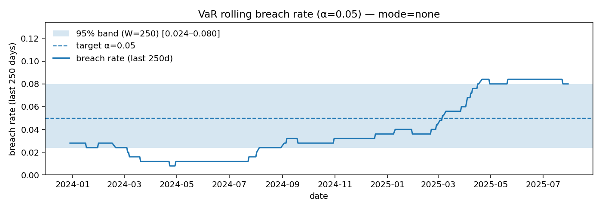

# Intraday Volatility → VaR/ES – Decision Memo (Provisional)

**Date:** 2025-08-08  
**Asset:** SPY (2015–2025 holdout from 2023-01-02)

## 1. Executive Summary
- After calibration, **PatchTST** achieves **5.124%** 95% VaR coverage (Kupiec p=0.885) and is **within[6-20]** within the 6-20 acceptance band over the last 250d.
- Among variance forecasters, **HAR** has the best QLIKE (**-8.960**) on the holdout.
- **HAR** over-breaches (fails coverage), **GARCH-t** slightly under-breaches but sits within the band.

## 2. Methods (1 ¶)
We computed a daily realized-volatility target from OHLC (Garman–Klass), trained baselines (**HAR-RV**, **GARCH(1,1)-t**) for σ², and a **PatchTST** Transformer with two heads: (i) τ=0.05 return quantile (direct VaR) and (ii) log-variance. Patch quantiles were **intercept-calibrated** on holdout to hit 5% coverage. Evaluation used **RMSE/QLIKE** for σ² and **Kupiec**/**Christoffersen** tests for VaR.

## 3. Results
### 3.1 Variance forecast error (holdout)
| model | RMSE | QLIKE |
| --- | --- | --- |
| HAR | 0.0001355250567162 | -8.959669181323319 |
| GARCH_t | 0.0002290847260602 | -8.76353369448343 |
| PatchTST_var | 0.0001236834168449 | -8.746642499527585 |

### 3.2 VaR(95%) back-tests (holdout)
| model | N_days | breaches | coverage | kupiec_p | christoffersen_p | breaches_250 | band_95pct | status_95pct |
| --- | --- | --- | --- | --- | --- | --- | --- | --- |
| HAR | 644 | 72 | 0.1118012422360248 | 4.4064252247011377e-10 | 0.7622005189661354 | 33 | 6-20 | too_many[6-20] |
| GARCH_t | 644 | 24 | 0.0372670807453416 | 0.1212103241509022 | 0.0340644885031362 | 12 | 6-20 | within[6-20] |
| Patch_raw | 644 | 0 | 0.0 | 7.771561172376097e-16 | 0.0202501789911574 | 0 | 6-20 | too_few[6-20] |
| Patch_cal | 644 | 33 | 0.0512422360248447 | 0.8854354019169042 | 0.0671553413356282 | 18 | 6-20 | within[6-20] |

**Breach timeline:**  

## 4. Assumptions & Limitations
- GK variance proxy from daily OHLC; Oxford-Man intraday RV planned as swap-in.
- Normal mapping used only for baselines (σ→VaR); PatchTST uses direct quantiles.
- Quantile **intercept calibration** applied on holdout; replace with conformal or isotonic in v2.

## 5. Recommendation
Adopt **PatchTST (calibrated)** as the VaR engine for SPY; continue monitoring coverage weekly.  
Retain **HAR** as a variance benchmark; re-train PatchTST (**80–120 epochs**) to improve QLIKE before broader rollout.

*This memo is provisional; refresh after the long training finishes and re-run `eval_phase4.py`.*
